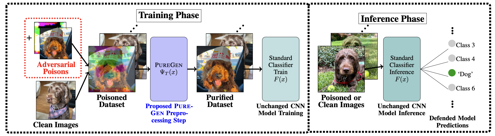
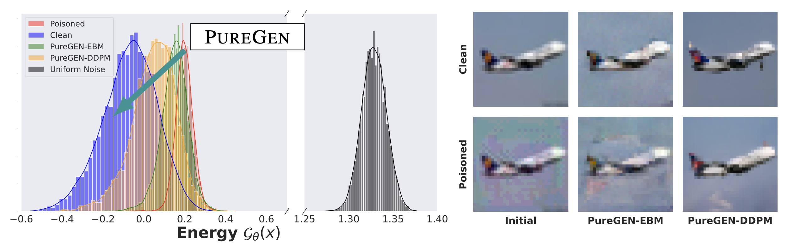

# [PureGEN: Universal Data Purification for Train-Time Poison Defense via Generative Model Dynamics](https://arxiv.org/abs/2405.18627)

See our [paper on arXiv](https://arxiv.org/abs/2405.18627), (as well as [PureEBM](https://arxiv.org/abs/2405.19376), *a subset work with more details on EBM poison defense*) 

## Introduction

Train-time data poisoning attacks threaten machine learning models by introducing adversarial examples during training, leading to misclassification. Current defense methods often reduce generalization performance, are attack-specific, and impose significant training overhead. To address this, we introduce a set of universal data purification methods using a stochastic transform, $\Psi(x)$, realized via iterative Langevin dynamics of Energy-Based Models (EBMs), Denoising Diffusion Probabilistic Models (DDPMs), or both. These approaches purify poisoned data with minimal impact on classifier generalization. Our specially trained EBMs and DDPMs provide state-of-the-art defense against various attacks (including Narcissus, Bullseye Polytope, Gradient Matching) on CIFAR-10, Tiny-ImageNet, and CINIC-10, without needing attack or classifier-specific information. We discuss performance trade-offs and show that our methods remain highly effective even with poisoned or distributionally shifted generative model training data.



### Key Contributions

* A set of state-of-the-art (SoTA) stochastic preprocessing defenses $\Psi(x)$ against adversarial poisons using MCMC dynamics of EBMs and DDPMs trained specifically for purification named PureGen-EBM and PureGen-DDPM and used in combination with techniques PureGen-Naive PureGen-Reps, and PureGen-Filt.
* Experimental results showing the broad application of $\Psi(x)$ with minimal tuning and no prior knowledge needed of the poison type and classification model
* Results showing SoTA performance can be maintained even when PureGen models’ training data includes poisons or is from a significantly different distribution than the classifier/attacked train data distribution.

### Generative Model Dynamics Pushes Poisoned Images Into the Clean Data Manifold




## Installation and Setup

To install and run this project, follow these steps (currently for TPU with `tpu-vm-pt-2.0` software version)

1. Clone the repository: ```git clone https://github.com/SunayBhat1/PureGen```
2. Make a Data Directory ```mkdir data``` (modify `--data_dir` if different)
3. Install the required packages: 
    - TPU: ```pip install -r requirements_TPU.txt```
    - GPU: ```pip install -r requirements.txt```
4. Navigate to the project directory: ```cd PureGen```
5. [Download poisons](https://drive.google.com/file/d/1ZJUIEGKKhENVSEzOg9WZ2j6s-6Ycrssn/view?usp=sharing), unzip and copy it primary data folder (args.data_dir) under /Poisons (default is /home/<user>/data/Poisons on TPU)
6. Download pretrained models and store under /<data_dir>/PureGen_Models/
    - [EBMs](https://drive.google.com/drive/folders/1rA_vHVy9yEzDpxrnExWk5C0LgY0IfoaN?usp=sharing), store in `/<data_dir>/PureGen_Models/EBMSNGAN32/`
    - [DDPMs](https://drive.google.com/drive/folders/1fC9oh6Sk3EBADw0fr-0SqUq2GYpy5xQN?usp=sharing), store in `/<data_dir>/PureGen_Models/DM_UNET/`
    - [Pretrained Transfer Models](https://drive.google.com/drive/folders/19NRNos6ywXRnZBSosli_jQhdfb4h5WB9?usp=sharing), store in `/<data_dir>/PureGen_Models/transfer_models/` *if running fine-tune or linear transfer poison scenarios* (credit BullseyePoison see below)
7. Datasets need to be uploaded to the `data_dir` above
    - CIFAR-10 will auto-download
    - [CIFAR-10 transfer split](https://drive.google.com/file/d/1bU8mz-MuJN2z7ZZjrhSGBmmiDlJpw3GM/view?usp=sharing) (credit BullseyePoison see below)
    - [tiny-imagenet-200](https://www.kaggle.com/datasets/nikhilshingadiya/tinyimagenet200)
    - [CINIC-10](https://datashare.ed.ac.uk/handle/10283/3192)

## Usage

### Purification

Purified data will be saved in `/<args.data_dir>/PureGen_PoisonDefense/<args.dataset>` under base dataset or poison path and with a purification `data_key` name

#### No Defense: 
```
# Purify Full Dataset (w/o poisons)
python3 purify.py --remote_user <TPU_remote_user> --ebm_model None --diff_model None;
# Purify Poisoned Samples (Replace with other poison_type if desired)
python3 purify.py --remote_user <TPU_remote_user> --ebm_model None --diff_model None --poison_type 'Narcissus';
```

**Poison Modes**:  
    - From Scratch (Default): ```--poison_mode 'from_scratch'```  
    - Transfer Base Dataset (CIFAR-10 only) ```--poison_type 'TransferBase'```  
    - Linear Transfer: ```--poison_mode 'linear_transfer'```  
    - Fine-Tune Transfer: ```--poison_mode 'fine_tune_transfer'```  
*Note that both transfer modes use same transfer dataset provided by Bullseye Poison Authors*  

**Poison Types**:  
    - Narcissus (Default, Triggered): ```--poison_type 'Narcissus'```  
    - Gradient Matching (Triggerless): ```--poison_type 'GradientMatching'```  
    - Bullseye Polytope (Triggerless): ```--poison_type 'BullseyePolytope'```  

#### EBM Only:
Modify `--ebm_name` if using another model (Default is CINIC-10 IMagenet Subset trained)
```bash
# Purify Full Dataset (w/o poisons)
python3 purify.py --remote_user <TPU_remote_user> --ebm_lang_steps 150 --diff_model None;
# Purify Poisoned Samples (Replace with other poison_type if desired)
python3 purify.py --remote_user <TPU_remote_user> --ebm_lang_steps 150 --diff_model None --poison_type 'Narcissus';
```

#### Diffusion Only:
Modify `--diff_name` if using another model (Default is CINIC-10 IMagenet Subset trained)
```bash
# Purify Full Dataset (w/o poisons)
python3 purify.py --remote_user <TPU_remote_user> --ebm_model None --diff_T 75;
# Purify Poisoned Samples (Replace with other poison_type if desired)
python3 purify.py --remote_user <TPU_remote_user> --ebm_model None --diff_T 75 --poison_type 'Narcissus';
```

#### JPEG Compression (Baseline): 
```bash
# Purify Full Dataset (w/o poisons)
python3 purify.py --remote_user <TPU_remote_user> --ebm_model None --diff_model None --jpeg_compression <Compression Ratio>;
# Purify Poisoned Samples (Replace with other poison_type if desired)
python3 purify.py --remote_user <TPU_remote_user> --ebm_model None --diff_model None --poison_type 'Narcissus' --jpeg_compression <Compression Ratio>;
```

### Train Classifiers

Note: Default model is [HyperLight Benchmark](https://github.com/tysam-code/hlb-CIFAR10) *See below for additional model config overrides*

```bash
# No Defense
python3 train_classifier.py --remote_user <User for TPU> --data_dir <Path to data folder> --poison_type 'Narcissus' --data_key "Baseline";
# EBM Defended Dataset
python3 train_classifier.py --remote_user <User for TPU> --data_dir <Path to data folder> --poison_type 'Narcissus' --data_key "EBM[cinic10_imagenet_ep120_nf32]_Steps[<ebm_lang_steps>]_T[0.0001]";
# DDPM Defended Dataset
python3 train_classifier.py --remote_user <User for TPU> --data_dir <Path to data folder> --poison_type 'Narcissus' --data_key "DM_UNET[cinic10_imagenet_DDPM[250]_nf[L]]_T[<diff_T>]";
```

#### Additonal Modes
- Linear Transfer: ```--config_overrides 'LINEAR_TRANSFER'```  
- Fine-Tune Transfer: ```--config_overrides 'FINE_TUNE'```  

#### Addiotnal Classifier Models
- For ResNet18 add: ```--config_overrides 'ResNet18'```  
- For MobileNetV2 add: ```--config_overrides 'MOBILE_NET'```  
- For DenseNet121 add: ```--config_overrides 'DENSE_NET'```  

Additional configuations and parameters can be found in the `Configs/config.ini` file.  
*Note: `config_overrides` arguments can be chained if desired (execute in order)*

<details>
<summary>Full command examples</summary>

```bash
### Purification 

## From Scratch

# Base Dataset (No Defense)
python3 purify.py --remote_user 'sunaybhat' --ebm_model None --diff_model None;
# Base Dataset (PureEBM)
python3 purify.py --remote_user sunaybhat --ebm_lang_steps 150 --diff_model None;
# Base Dataset (PureDDPM)
python3 purify.py --remote_user sunaybhat --ebm_model None --diff_T 75;  
# Base Dataset (JPEG Compression)
python3 purify.py --remote_user sunaybhat --ebm_model None --diff_model None --jpeg_compression 25;

# Narcissus (No Defense)
python3 purify.py --remote_user 'sunaybhat' --ebm_model None --diff_model None --poison_type 'Narcissus';
# Narcissus (PureEBM)
python3 purify.py --remote_user sunaybhat --ebm_lang_steps 150 --diff_model None --poison_type 'Narcissus';
# Narcissus (PureDDPM)
python3 purify.py --remote_user sunaybhat --ebm_model None --diff_T 75 --poison_type 'Narcissus';
# Narcissus (JPEG Compression)
python3 purify.py --remote_user sunaybhat --ebm_model None --diff_model None --poison_type 'Narcissus' --jpeg_compression 25; 

# Gradient Matching (No Defense)
python3 purify.py --remote_user sunaybhat --ebm_model None --diff_model None --poison_type 'GradientMatching';

## Linear Transfer (No Defense)
# Base Transfer Dataset
python3 purify.py --remote_user sunaybhat --ebm_model None --diff_model None --poison_type 'TransferBase';
# Bullseye Poltyope Linear Transfer
python3 purify.py --remote_user sunaybhat --ebm_model None --diff_model None --poison_mode 'linear_transfer' --poison_type 'BullseyePolytope';

### Classifier Training

## From Scratch Narcissus
# No Defense
python3 train_classifier.py --remote_user sunaybhat --poison_type 'Narcissus' --data_key "Baseline";
# EBM Defended Dataset
python3 train_classifier.py --remote_user sunaybhat --poison_type 'Narcissus' --data_key "EBM[cinic10_imagenet_nf[128]_Steps[150]_T[0.0001]";
# DDPM Defended Dataset
python3 train_classifier.py --remote_user sunaybhat --poison_type 'Narcissus' --data_key "DM_UNET[cifar10_DDPM[250]_nf[L]]_T[15]";
# No Defense ResNet18
python3 train_classifier.py --remote_user sunaybhat --poison_type 'Narcissus' --data_key "Baseline" --config_overrides 'ResNet18';

## From Scratch Gradient Matching (No Defense)
python3 train_classifier.py --remote_user sunaybhat --poison_type 'GradientMatching';

## Linear Transfer Bullseye Polytope (No Defense)
python3 train_classifier.py --remote_user sunaybhat --config_overrides 'LINEAR_TRANSFER' --poison_type 'BullseyePolytope';
```

</details>


## Analyze Results

See the `Results.ipynb` to examples of how to read and parse the results csv's that are saved. 

## License

Shield: [![CC BY-ND 4.0][cc-by-nd-shield]][cc-by-nd]

This work is licensed under a
[Creative Commons Attribution-NoDerivs 4.0 International License][cc-by-nd].

[![CC BY-ND 4.0][cc-by-nd-image]][cc-by-nd]

[cc-by-nd]: https://creativecommons.org/licenses/by-nd/4.0/
[cc-by-nd-image]: https://licensebuttons.net/l/by-nd/4.0/88x31.png
[cc-by-nd-shield]: https://img.shields.io/badge/License-CC%20BY--ND%204.0-lightgrey.svg

## References

This project was built using the following open-source repositories:

- [BullseyePoison](https://github.com/ucsb-seclab/BullseyePoison): Bullseye Polytope poisons, transfer models, and transfer dataset.
- [EPIC](https://github.com/YuYang0901/EPIC): Epic defense code was added to `train_classifier.py` and `utils_baslines.py`.
- [Friendly Noise](https://github.com/tianyu139/friendly-noise): Friendly noise defense code was added to `train_classifier.py` and `utils_baslines.py`.
- [Poisoning Benchmarks](https://github.com/aks2203/poisoning-benchmark/tree/master): BP Benchmarks and dataloaders users for white-box R18 attack
- [HyperLight Benchmark](https://github.com/tysam-code/hlb-CIFAR10): Super Fast convergence on CIFAR-10 models

We would like to thank the authors of these repositories for their contributions to the open-source community.

## Acknowledgements
This work is supported with Cloud TPUs from [Google’s Tensorflow Research Cloud (TFRC)](https://sites.research.google/trc/about/).

## Contact

If you have any questions or feedback, please contact [Sunay Bhat](mailto:sunaybhat1@ucla.edu).
